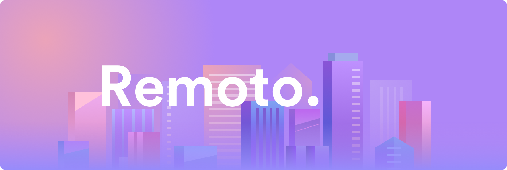

# Remoto

Ultra-simple, fast, complete RPC ecosystem designed for right now.

* Simple service definitions written in Go (interfaces and structs)
* Generates servers and clients that makes implementing/consuming easy
* Generates human-readable code
* Supports batch requests out of the box
* Lots of [templates](templates) to use today
* Modify templates or write your own

## In this document

* [Introduction](#introduction) - Start learning about Remoto in the introduction
* [Remoto Definition Files](#remoto-definition-files) - An overview of the Remoto definition files
* [Remoto command](#remoto-command) - The `remoto` command line tool
* [remotohttp](#remotohttp) - Templates for Remoto powered HTTP servers and clients

# Introduction

Remoto is an RPC ecosystem and code generation tool. A powerful set of templates and
supporting code allows you to quickly spin up RPC services, and consume them with hand crafted
client libraries by experts in each particular language.

## Who is Remoto for?

Remoto is for teams who want to:

* Deliver mobile and web RPC services
* Automate SDK and client library generation
* Stick with simple and familiar technology

# Remoto definition files

Definition files are Go source with `.remoto.go` file extension.

An example definition looks like this:

```go
package project

// Greeter provides greeting services.
type Greeter interface {
	// Greet generates a greeting.
	Greet(GreetRequest) GreetResponse
}

// GreetRequest is the request for Greeter.GreetRequest.
type GreetRequest struct {
	Name string
}

// GreetResponse is the response for Greeter.GreetRequest.
type GreetResponse struct {
	Greeting string
}
```

* `package project` - package name can group services
* `type ServiceName interface` - describes an RPC service
* `Greet(GreetRequest) GreetResponse` - service method with request and response objects
* `type GreetRequest struct` - describes the request data
* `type GreetResponse struct` - describes the response data

## Rules

* Each service is an `interface`
* Each method is an endpoint
* Methods must take a request object as its only argument
* Methods must return the response object as the result
* Only a subset of Go types are supported: `string`, `float64`, `int`, `bool`, and `struct` types
* Any arrays (slices) of the supported types are also allowed (e.g. `[]string`, `[]bool`, etc.)
* Comments describe the services, methods and types
* Do not import packages (apart from official Remoto ones), instead your definition files should be self contained

## Special types

* Learn more about specially handled types in [remototypes](remototypes).

## Tips

* Avoid importing common types - describe all the required types in a single `.remoto.go` file

# Remoto command

The `remoto` command can be built into your development pipeline to generate source code from
definition files.

```
usage:
	remoto sub-command
```

## Generate

The generate command generates source code from a given template.

```
usage:
	remoto generate definition template -o output-file
```

* `definition` - Path to the definition file
* `template` - Path to the template to render
* `output-file` - Where to save the output (folders will be created and files will be overwritten without warning)

# remotohttp

As well as code generation, Remoto ships with a complete HTTP client/server implementation which you can generate from your definition files.

For more information, see the [remotohttp documentation](go/remotohttp).
